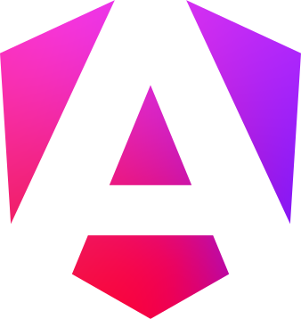
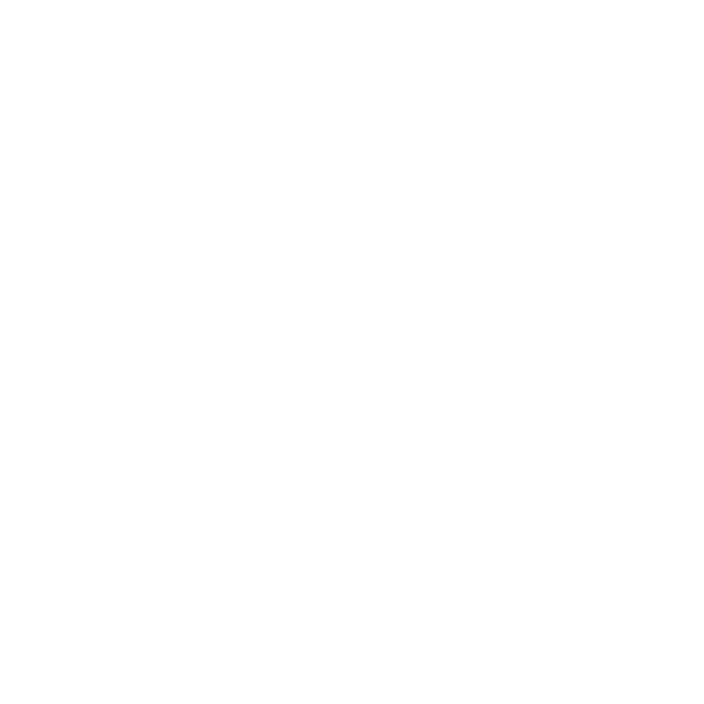

# Maxim
<p align="center">
    
    
    
</p>

## Inicializar proyecto

```bash 
pnpm nx serve client
```

## Comandos Útiles

### Generar Librería

Para generar una nueva librería en el monorepo:

```bash
# Angular Library
pnpm nx g @nx/angular:lib my-lib

# NestJS Library
pnpm nx g @nx/nest:lib my-lib
```

### Angular (Client)

Comandos para generar elementos dentro de la aplicación Angular (`client`):

```bash
# Generar Componente
pnpm nx g @nx/angular:component my-component --project=client

# Generar Servicio
pnpm nx g @nx/angular:service my-service --project=client

# Generar Módulo
pnpm nx g @nx/angular:module my-module --project=client

# Generar Pipe
pnpm nx g @nx/angular:pipe my-pipe --project=client

# Generar Directiva
pnpm nx g @nx/angular:directive my-directive --project=client
```

### NestJS (API)

Comandos para generar elementos dentro de la aplicación NestJS (`api`):

```bash
# Generar Recurso (CRUD completo: Module, Controller, Service, DTO, Entity)
pnpm nx g @nx/nest:resource my-resource --project=api

# Generar Controlador
pnpm nx g @nx/nest:controller my-controller --project=api

# Generar Servicio
pnpm nx g @nx/nest:service my-service --project=api

# Generar Módulo
pnpm nx g @nx/nest:module my-module --project=api
```

### Ejecutar Aplicaciones

```bash
# Ejecutar Monorepo
pnpm nx serve client
```